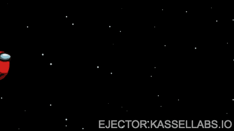

# Ejector

> An Among Us tribute application to create GIF with the eject scene



**https://ejector.kassellabs.io/**

This is a [Next.js](https://nextjs.org/) project bootstrapped with [`create-next-app`](https://github.com/vercel/next.js/tree/canary/packages/create-next-app).

## Development

First, run the development server:

```sh
npm run dev
```

Open [http://localhost:3000](http://localhost:3000) with your browser to see the result.