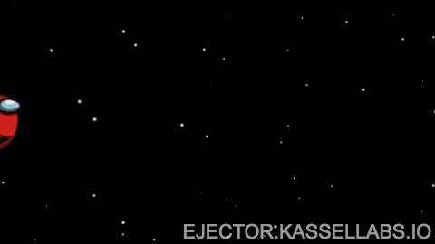

# Ejector

> An Among Us tribute application: upload a photo or GIF of your face, and get
> back the classic "ejection" animation with your character — export it as a
> free watermarked GIF or a paid MP4.

[](https://ejector.kassellabs.io/)

**Production: [https://ejector.kassellabs.io/](https://ejector.kassellabs.io/)**

## Setup

```sh
npm install
cp .env.example .env.local
npm run dev
```

Open [http://localhost:3000](http://localhost:3000) with your browser to see
the result.

## Environment variables

All client-exposed config lives in `.env.local` (see `.env.example` for the
template) and is read once in `src/lib/config.ts`.

| Variable | Purpose | Default when unset |
| --- | --- | --- |
| `NEXT_PUBLIC_PAYMENT_PAGE_URL` | Origin of the payment-frontend app embedded as an iframe for checkout, and the only origin `postMessage` payment-success events are trusted from. | `https://payment.kassellabs.io` |
| `NEXT_PUBLIC_PAYMENT_API_URL` | Base URL of the payment-backend API, used for the `GET /payment/ejector/:code/paid` paid-status check. **Must be set in production** (the payment-backend origin) — when unset it resolves same-origin, so the 24h paid-status restore silently no-ops and returning paid users are re-prompted to pay. Production value: `https://api.payment.kassellabs.io`. | `""` (same-origin) |
| `NEXT_PUBLIC_ADMIN_GRAPHQL_URL` | GraphQL endpoint on `admin.kassellabs.io` used for newsletter subscribe/unsubscribe. | `https://admin.kassellabs.io/graphql` |
| `NEXT_PUBLIC_GA_ID` | Google Analytics measurement ID. Tracking is a no-op when unset. | `""` (disabled) |

## Scripts

| Script | Purpose |
| --- | --- |
| `npm run dev` | Start the Next.js dev server. |
| `npm run build` | Production build. |
| `npm start` | Serve the production build. |
| `npm run lint` | ESLint. |
| `npm run typecheck` | `tsc --noEmit`. |
| `npm test` / `npm run test:watch` | Vitest unit + component tests. |
| `npm run test:coverage` | Vitest with the `src/lib/` coverage gate (80% lines/branches). |
| `npm run e2e` / `npm run e2e:ui` | Playwright end-to-end tests (Chromium). |

## Architecture

- **100% in-browser video pipeline.** There is no server-side renderer. The
  eject animation is a [Remotion](https://www.remotion.dev/) composition
  (`src/remotion/EjectorComposition.tsx`) previewed live with `@remotion/player`
  and exported client-side: MP4 via `@remotion/web-renderer` (WebCodecs), GIF
  via `gifenc`. The animation timing constants
  (`src/lib/animationConstants.ts`) and composition logic are a direct port of
  the original canvas implementation — see the `legacy-canvas` git tag for the
  ground-truth reference (`git show legacy-canvas:src/util/drawAnimation.js`).
- **Payment is a soft gate**, backed by two sibling repos that must be
  deployed together with this app:
  - **payment-frontend** (branch `feat/ejector-app`) is embedded as an iframe
    for checkout and communicates success back via `postMessage`.
  - **payment-backend** (branch `feat/ejector-app`) exposes
    `GET /payment/ejector/:code/paid`, keyed by a client-generated UUID
    persisted in `localStorage` (`ejector-payment-code`), which restores a
    24-hour unlimited-download window on return visits.
  - GIF export is always free (watermarked). MP4 is paid: $3 for a
    watermarked 720p file, $5 for a clean 1080p file.
- **Newsletter** subscribe/unsubscribe goes directly to `admin.kassellabs.io`'s
  GraphQL API (no proxy through this app's own backend, because there isn't
  one).
- **i18n**: English and pt-BR dictionaries in `src/locales/`, selected via
  `useT()` (`src/lib/i18n.tsx`), auto-detected from the browser locale and
  persisted in `localStorage`.

## Browser support

Live preview (the Remotion `<Player>`) works in any modern browser. **MP4 and
GIF export require [WebCodecs](https://developer.mozilla.org/en-US/docs/Web/API/WebCodecs_API
)**, so exporting is limited to Chromium-based browsers (Chrome, Edge) and
recent Safari. `src/lib/render/capability.ts` detects support up front and
the UI surfaces an explicit "unsupported browser" state rather than failing
silently mid-render.
